# Q8Tickets Screenshots

This document showcases the main interfaces and features of the **Q8Tickets** application.

---

## Sign In

The user authentication page where registered users can securely access the application.

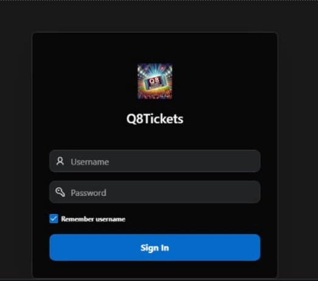

---

## Sign Up

Landing page allowing new users to create an account or existing users to navigate to the login page.

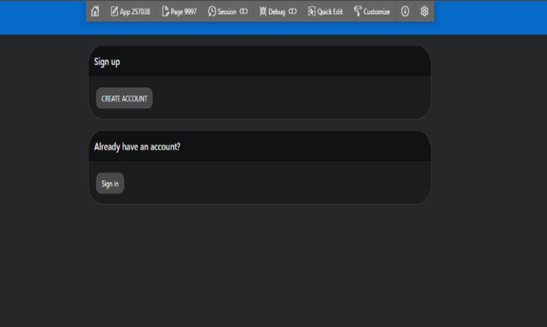

---

## Create Account

Registration form for creating a new user account.

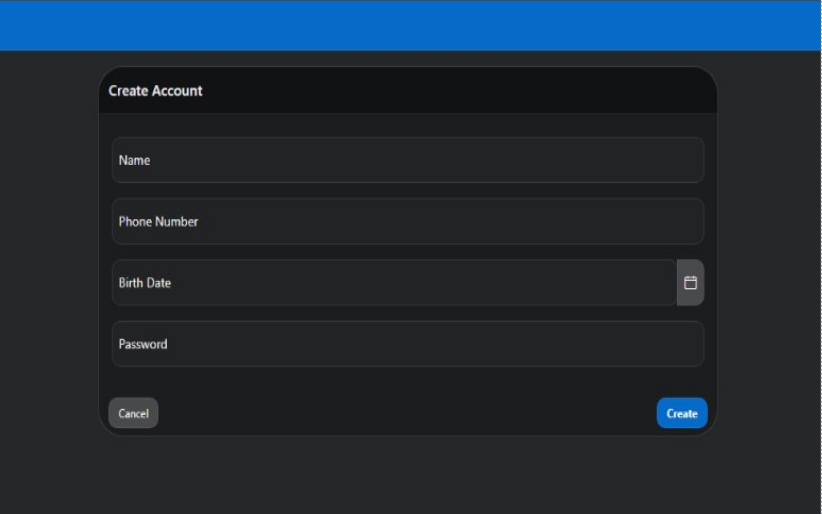

---

## Match Listing

Displays upcoming football matches with match date, time, stadium information, and booking option.

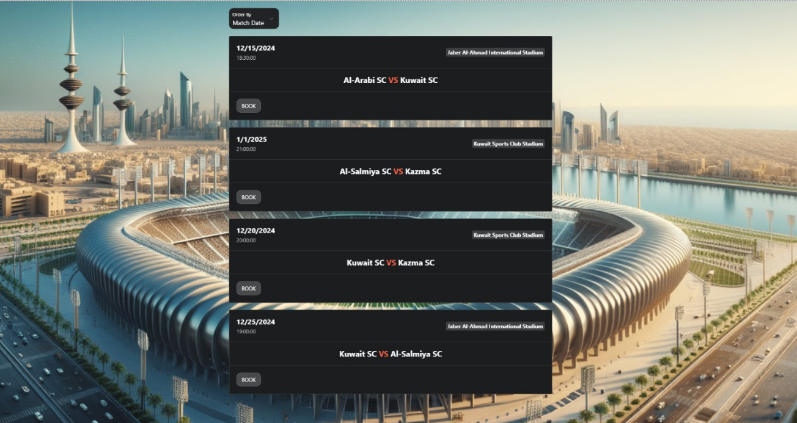

---

## Ticket Booking

Booking interface where users select the match, seating section, payment method, row, seat number, and number of tickets.

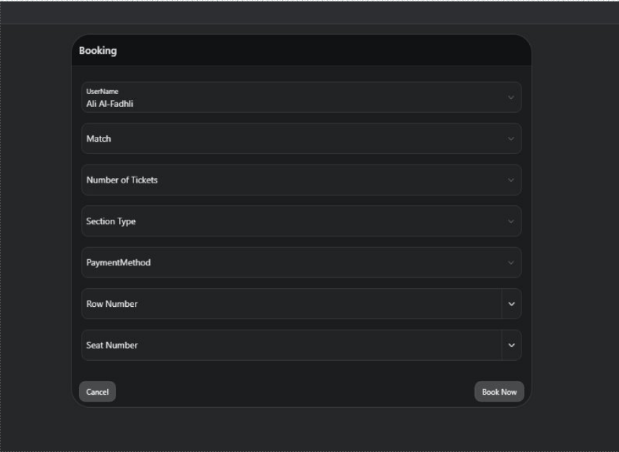

---

## Booking Summary

Displays booking details, payment information, generated barcode, and sharing options after a successful reservation.

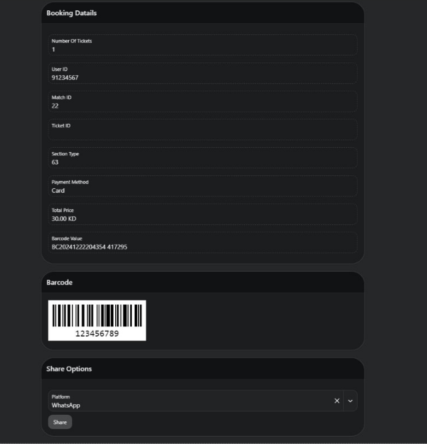

---

## Modify Booking

Allows users to update an existing booking, including ticket quantity and seating section.

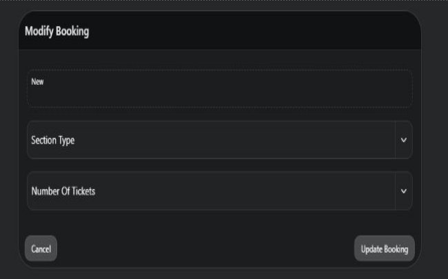

---

## Customer Management

Administrative page for managing customer records stored in the database.

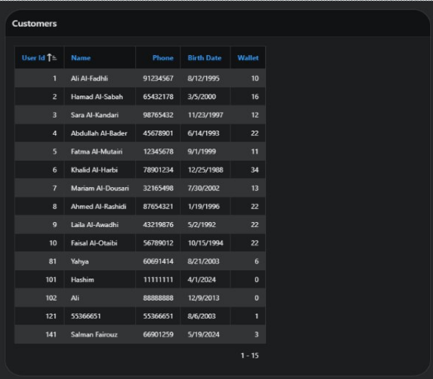

---

## Stadium Management

Administrative interface displaying stadium information and location links.

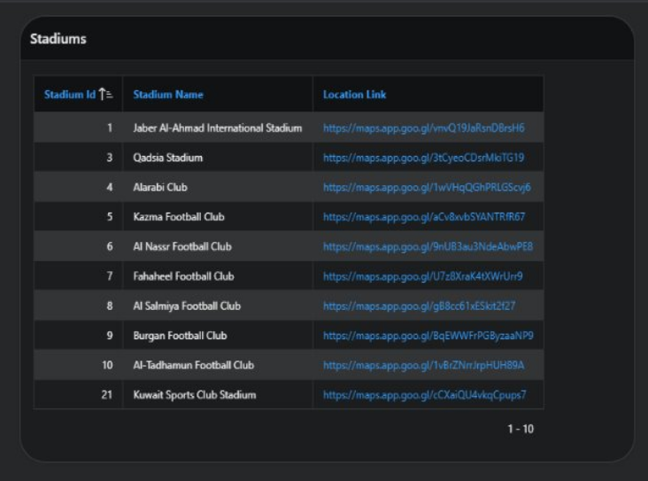

---

## Player Statistics Dashboard

Interactive dashboard presenting player performance metrics including:

- Goals
- Shots on Target
- Yellow Cards
- Red Cards
- Fouls

along with a detailed statistics table.

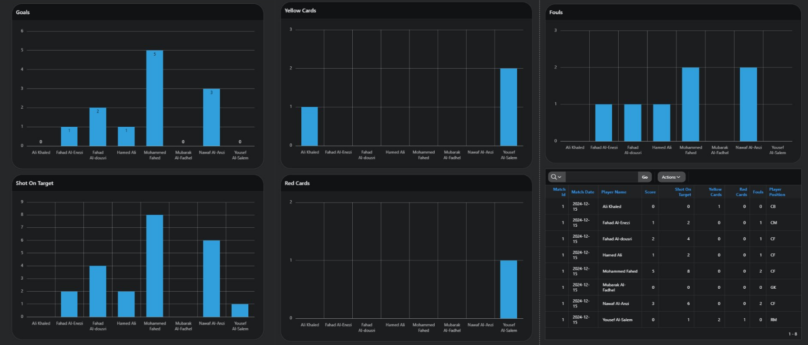

---

## Booking Statistics Dashboard

Dashboard visualizing booking activity across football matches.

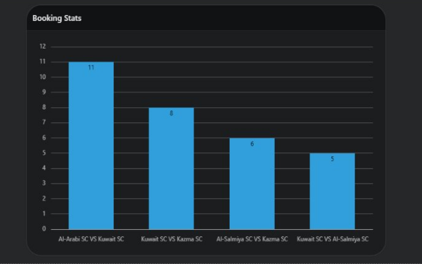

---

## Feedback

Users can rate their booking experience and submit comments after attending a match.

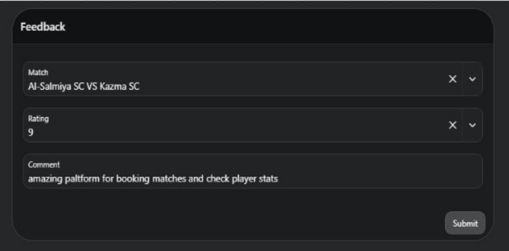
